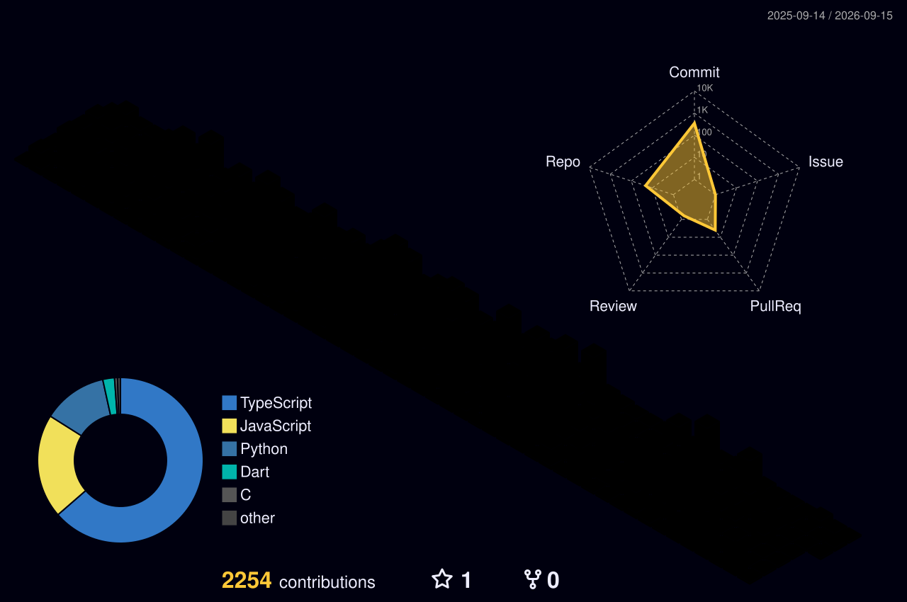

 

  

 

## About

Founder of **[Nexolve AI Solutions LLP](https://nexolve.co.in)** — a Pune-based software studio building for startups and growing businesses across India, the US, the UK, Europe, and Asia.

Founded Nexolve in **2021** to fix a specific gap in software services: most agencies bill for headcount and hours, not for shipping the right product. Nexolve's positioning — *"engineering built for depth, not headcount"* — reflects that founding intent. Over five years, that's meant shipping agentic AutoML platforms, zero-knowledge enterprise AI agents, vertical e-commerce marketplaces, and government supply-chain forecasting systems — with a founder who works every scoping call personally and stays accountable through delivery.

<table align="center">
<tr>
<td align="center" width="25%">🚀 <b>MVP Development</b> Idea → live product, fast</td>
<td align="center" width="25%">🧩 <b>Custom SaaS</b> Built around your logic</td>
<td align="center" width="25%">🤖 <b>AI Agents & Automation</b> Production deployment patterns</td>
<td align="center" width="25%">🏗️ <b>Multi-tenant Architecture</b> Built to scale from day one</td>
</tr>
</table>

 

## Tech Stack

**Frontend & Motion**

**Backend, Data & AI**

**Infra & Deploy**

 

## Featured Builds

Six of forty‑plus shipped engagements — full portfolio at <a href="https://nexolve.co.in/projects">nexolve.co.in/projects</a>, engineering teardowns at <a href="https://nexolve.co.in/blogs?category=engineering">the blog</a>.

<table>
<tr>
<th align="left">Project</th>
<th align="left">What it does</th>
<th align="left">Status</th>
</tr>
<tr>
<td><a href="https://nexolve.co.in/projects/estateflow-ai"><b>EstateFlow AI</b></a></td>
<td>WhatsApp agentic AI for real estate lead automation</td>
<td></td>
</tr>
<tr>
<td><a href="https://nexolve.co.in/projects/medibook-crm"><b>MediBook</b></a></td>
<td>Appointment booking, CRM & email automation for healthcare practices</td>
<td></td>
</tr>
<tr>
<td><a href="https://nexolve.co.in/projects/linkure-hub"><b>Linkure Hub</b></a></td>
<td>Swipe-based startup matchmaking for founders, talent & investors</td>
<td></td>
</tr>
<tr>
<td><a href="https://nexolve.co.in/projects/chanakyaverse"><b>Chanakyaverse</b></a></td>
<td>Daily Chanakya Neeti & Arthashastra, ad-free</td>
<td></td>
</tr>
<tr>
<td><a href="https://nexolve.co.in/projects/poko-stories"><b>Poko Stories</b></a></td>
<td>Serialized fiction platform for night owls</td>
<td></td>
</tr>
<tr>
<td><a href="https://nexolve.co.in/projects/rajendra-shende"><b>Rajendra Shende</b></a></td>
<td>Digital home for an environmentalist, author & Nobel contributor</td>
<td></td>
</tr>
</table>

 

## GitHub Analytics

 

## 3D Contribution Grid

<picture>
  <source media="(prefers-color-scheme: dark)" srcset="profile-3d-contrib/profile-night-rainbow.svg">
  <source media="(prefers-color-scheme: light)" srcset="profile-3d-contrib/profile-season.svg">
  
</picture>

 

<picture>
  <source media="(prefers-color-scheme: dark)" srcset="https://raw.githubusercontent.com/maitreya-ai/maitreya-ai/output/github-contribution-grid-snake-dark.svg">
  <source media="(prefers-color-scheme: light)" srcset="https://raw.githubusercontent.com/maitreya-ai/maitreya-ai/output/github-contribution-grid-snake.svg">
  
</picture>

 

## Let's build something

I run the scoping process for every Nexolve engagement personally. Tell us what you're building — we come back with a scoped plan within 48 hours.

